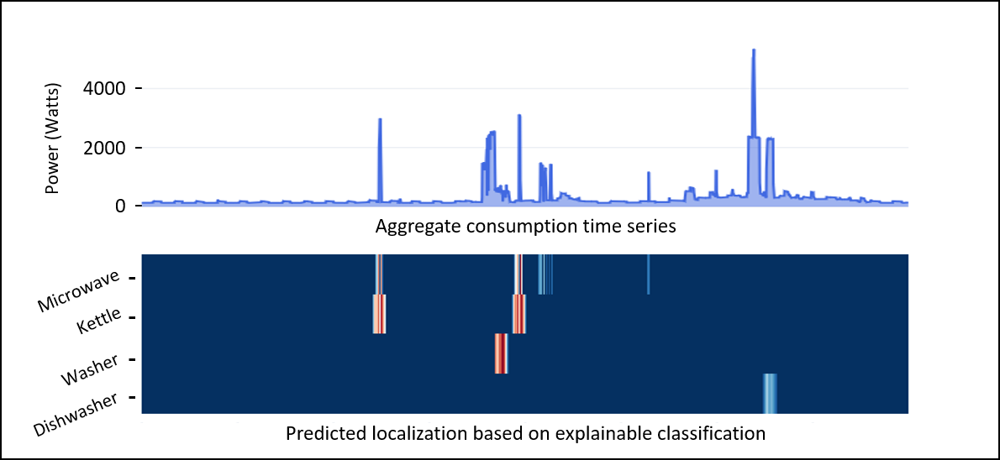

<h1 align="center">DeviceScope</h1>

<h2 align="center">An interactive tool to browse, detect and localize appliance patterns in electrical consumption time series</h2>

 

<a href="https://whichdevice.streamlit.app/">Try our demo</a>

DeviceScope is a Python-based web interactive tool that enables to understand better smart meters time series data.
The application facilitate the understanding of electrical consumption patterns by identifying and localizing individual appliance usage within electrical consumption data.

## Contributors

* [Adrien Petralia](https://adrienpetralia.github.io/), EDF R&D, Université Paris Cité
* [Paul Boniol](https://boniolp.github.io/), Inria, ENS, PSL University, CNRS
* [Philippe Charpentier](https://www.researchgate.net/profile/Philippe-Charpentier), EDF R&D
* [Themis Palpanas](https://helios2.mi.parisdescartes.fr/~themisp/), Université Paris Cité, IUF

## Usage

## Acknowledgments
